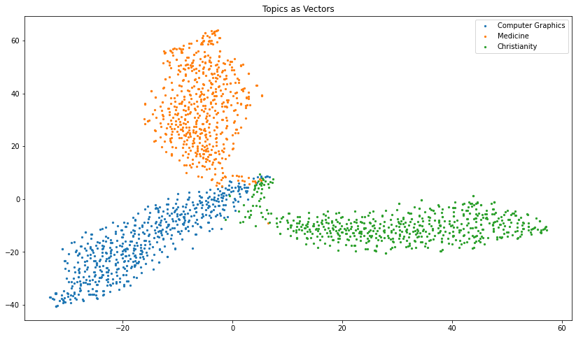
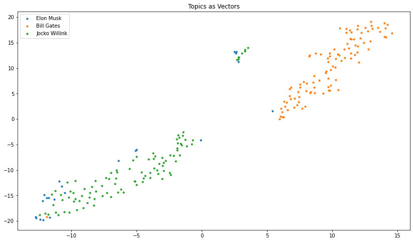

# Documents Analysis with Gensim Doc2Vec

## 1. Import Libraries


```python
from gensim.models.doc2vec import Doc2Vec, TaggedDocument
from gensim.utils import simple_preprocess
from sklearn.datasets import fetch_20newsgroups
from sklearn.decomposition import PCA
from sklearn.manifold import TSNE
import matplotlib.pyplot as plt
from twitter import TwitterAPI
```

## Example #1: 20 news groups

### Data


```python
news = fetch_20newsgroups(categories=['comp.graphics','sci.med','soc.religion.christian'])
data = news.data
target = news.target
target_names = news.target_names
```

### Preprocessing


```python
train_corpus = []
for i in range(len(data)):
    tokens = simple_preprocess(data[i])
    train_corpus.append(TaggedDocument(tokens, [target[i]]))
```

### Model


```python
model = Doc2Vec(vector_size=50, min_count=2, epochs=40)
model.build_vocab(train_corpus)
model.train(train_corpus, total_examples=model.corpus_count, epochs=model.epochs)
```

### Evaluation


```python
vectors = [model.infer_vector(i.words) for i in train_corpus]
pca = PCA(2)
vectors_2d = pca.fit_transform(vectors)

comp     = [vectors_2d[i].tolist() for i in range(len(vectors_2d)) if target[i] == 0]
med      = [vectors_2d[i].tolist() for i in range(len(vectors_2d)) if target[i] == 1]
religion = [vectors_2d[i].tolist() for i in range(len(vectors_2d)) if target[i] == 2]
```


```python
tsne = TSNE(2)
vectors_2d = tsne.fit_transform(vectors)

comp     = [vectors_2d[i].tolist() for i in range(len(vectors_2d)) if target[i] == 0]
med      = [vectors_2d[i].tolist() for i in range(len(vectors_2d)) if target[i] == 1]
religion = [vectors_2d[i].tolist() for i in range(len(vectors_2d)) if target[i] == 2]
```


```python
plt.figure(figsize=(14,8))
plt.scatter([i[0] for i in comp], [i[1] for i in comp], s=5, label='Computer Graphics')
plt.scatter([i[0] for i in med], [i[1] for i in med], s=5, label='Medicine')
plt.scatter([i[0] for i in religion], [i[1] for i in religion], s=5, label='Christianity')
plt.title('Topics as Vectors')
plt.legend()
plt.show()
```


    

    


```python
print(data[700])
```

    From: rob@rjck.UUCP (Robert J.C. Kyanko)
    Subject: Re: Weitek P9000 ?
    Distribution: world
    Organization: Neptune Software Inc
    Lines: 23
    
    abraxis@iastate.edu writes in article <abraxis.734340159@class1.iastate.edu>:
    > 
    > Anyone know about the Weitek P9000 graphics chip?
    > Micron is selling it with their systems They rank them at 50 winmarks...
    > Any info would help...
    > thanks.
    
    It's supposedly a high-performance chip based upon workstation graphics
    accelerators.  It's quite fast (I have 7), but as usual with new boards/chips
    the drivers are buggy for Windows.  As far as Winmarks go, it depends upon
    the version.  I think I got 42M winmarks with version 3.11.  2.5 yielded the
    50+ number.  I've also benchmarked this with Wintach at over 65 (from memory
    as well).
    
    As far as the low-level stuff goes, it looks pretty nice.  It's got this
    quadrilateral fill command that requires just the four points.
    
    It's very fast, but beware of buggy drivers, and otherwise no non-windows
    support.
    
    --
    I am not responsible for anything I do or say -- I'm just an opinion.
                 Robert J.C. Kyanko (rob@rjck.UUCP)
    


```python
test = simple_preprocess(data[500])
test_vector = model.infer_vector(test)
for i in model.dv.most_similar(positive=[test_vector]):
    print(f'{target_names[i[0]]}, {i[1]:.3f}')
```

    comp.graphics, 0.852
    sci.med, 0.589
    soc.religion.christian, 0.524


```python
model.dv.cosine_similarities(test_vector, vectors).argsort()[::-1][:10]
```


    array([ 500, 1194, 1105, 1204,  537,  469, 1509,  604, 1322,  922])


## Example #2: Tweets

### Data


```python
t = TwitterAPI()
elonmusk = t.timeline('44196397', max_results=100)
billgates = t.timeline('50393960', max_results=100)
jockowillink = t.timeline('3320010078', max_results=100)
```

    You're using Twitter API version 2


```python
elonmusk_tweets = [i['text'] for i in elonmusk['data']]
billgates_tweets = [i['text'] for i in billgates['data']]
jockowillink_tweets = [i['text'] for i in jockowillink['data']]
```


```python
tweets = elonmusk_tweets + billgates_tweets + jockowillink_tweets
labels = [0]*len(elonmusk_tweets) + [1]*len(billgates_tweets) + [2]*len(jockowillink_tweets)
label_names = {0: 'Elon Musk', 1: 'Bill Gates', 2: 'Jocko Willink'}
```

### Preprocessing


```python
train_corpus = []
for i in range(len(tweets)):
    tokens = simple_preprocess(tweets[i])
    train_corpus.append(TaggedDocument(tokens, [labels[i]]))
```

### Model


```python
model = Doc2Vec(vector_size=60, min_count=2, epochs=40)
model.build_vocab(train_corpus)
model.train(train_corpus, total_examples=model.corpus_count, epochs=model.epochs)
```

### Evaluation


```python
vectors = [model.infer_vector(i.words) for i in train_corpus]
tsne = TSNE(2)
vectors_2d = tsne.fit_transform(vectors)

plt.figure(figsize=(14,8))
plt.scatter(vectors_2d[:22, 0], vectors_2d[:22, 1], s=10, label='Elon Musk')
plt.scatter(vectors_2d[22:122, 0], vectors_2d[22:122, 1], s=10, label='Bill Gates')
plt.scatter(vectors_2d[122:222, 0], vectors_2d[122:222, 1], s=10, label='Jocko Willink')
plt.title('Topics as Vectors')
plt.legend()
plt.show()
```


    

    


```python
test = simple_preprocess('AI')
test_vector = model.infer_vector(test)
for i in model.dv.most_similar(positive=[test_vector]):
    print(f'{label_names[i[0]]}, {i[1]:.3f}')
```

    Elon Musk, 0.986
    Jocko Willink, 0.928
    Bill Gates, 0.778


```python
model.dv.cosine_similarities(test_vector, vectors).argsort()[::-1][:10]
```


    array([ 4,  1,  6, 19, 47, 16,  8, 52, 20, 43])


### Misc


```python
def distance(x: list, y: list) -> float:
    '''
    Compute distance between two vectors:

    >>> distance([1, 2],[1, -3])
    5.0
    '''
    return sum([(i-j)**2 for i, j in zip(x, y)])**(1/2)


def cosine(x: list, y: list) -> float:
    '''
    Compute cosine similarity between two vectors:

    >>> cosine([0, 1], [1, 0])
    0.0
    '''
    dot = sum([i*j for i,j in zip(x,y)])
    mag_x = sum([i**2 for i in x])**(1/2)
    mag_y = sum([i**2 for i in y])**(1/2)    
    return dot / (mag_x * mag_y)
```
